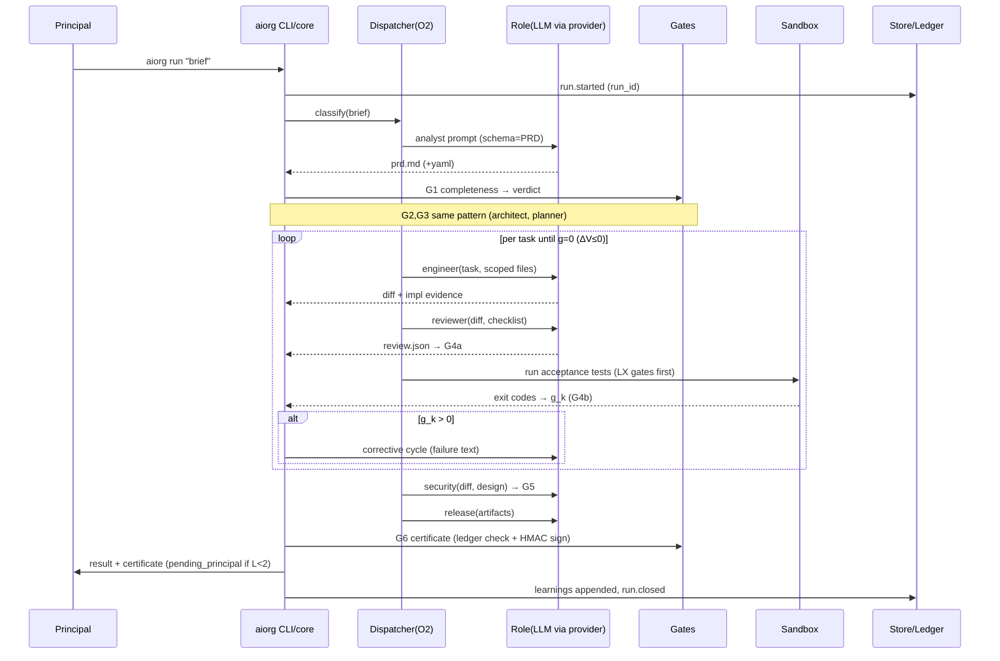

# 04 — Architecture: Flow of Code

Status: DRAFT for owner approval. Defines the implementation shape the build
must follow (milestones realize this document; code may not deviate without a
doc change in the same commit).

---

## 1. Shape at a glance

```
┌──────────────────────────  D:\aiorg  (self-contained repo)  ──────────────────────────┐
│                                                                                       │
│  aiorg CLI (bin) ──────────────► org runtime (core)                                   │
│   ask / run / resume            ┌──────────────────────────────────────────────┐      │
│   status / audit / replay       │ Dispatcher state machine (SOP compiled)      │      │
│   serve (--mcp)                 │  ├ role engine (profiles, schema-retry)      │      │
│                                 │  ├ gate runner (G1..G6, LX language gates)   │      │
│  MCP server ◄── opencode/       │  ├ converge loop (ΔV≤0, guards, budgets)     │      │
│  (opencodelocal, oclrust…)      │  └ cert issuer (HMAC chain)                  │      │
│   tools: aiorg_ask_role,        └───┬───────────────┬──────────────┬───────────┘      │
│   aiorg_run, aiorg_status…          │               │              │                  │
│                                provider          store          sandbox               │
│                              (OpenAI-compat    (SQLite WAL     (WSL bwrap scope /     │
│                               :8830/:11434,     ledger, runs,    Job Object host mode) │
│                               SSE stream,       hash-chain,                            │
│                               reasoning_content replay)                                │
└───────────────────────────────────────────────────────────────────────────────────────┘
        │ loopback only                          ▲ artifacts of record live HERE
        ▼                                        │ <project>/.aiorg/runs/<run_id>/…
  llama.cpp router :8830 (models swap by request) · Ollama :11434 (fallback light roles)
```

**D:\Harness is an external tool.** AIORG contains its own provider/store/sandbox
implementations. No path or git dependency on any other local project (repo law).

## 2. Workspace layout

```
D:\aiorg\
├─ Cargo.toml                # workspace
├─ engine\
│  ├─ core\     # SOP state machine, role engine, converge loop, gates, RBAC, cert
│  ├─ provider\ # OpenAI-compatible client: router + ollama; SSE; reasoning_content;
│               # retry/circuit-breaker; JSON-schema validate+retry envelope
│  ├─ store\    # SQLite (WAL): runs/tasks/artifacts/events/certificates/learnings;
│               # hash-chained append-only audit; migrations idempotent
│  ├─ sandbox\  # WSL bwrap + systemd-run scope launcher; host Job-Object mode;
│               # NUL-sep config files (never env), OOM via systemd Result
│  ├─ mcp\      # MCP server (stdio default, streamable HTTP opt) exposing roles
│  └─ cli\      # bin `aiorg` (clap); serve mode with SSE /status (:8850)
├─ org\
│  ├─ roles\*.toml    # 9 role profiles (prompt, model route, tools, schema ref)
│  ├─ sop\*.toml      # stage/gate definitions compiled into the state machine
│  ├─ policy\*.toml   # budgets ceilings, RBAC matrix, autonomy rules, ports
│  └─ schemas\*.json  # artifact JSON Schemas (prd front-matter, reports, cert)
├─ data\                      # central index DB (gitignored): cross-project registry
├─ tests\fixtures\            # graded fixtures T1–T5 style across languages
└─ docs\                      # this documentation set (truth source)
```

## 3. Control flow (one full run)



## 4. Provider layer contract

- Endpoints: `POST {base}/v1/chat/completions` (router `http://127.0.0.1:8830/v1`;
  ollama fallback `http://127.0.0.1:11434/v1`). Loopback enforced.
- **Reasoning models:** merge `message.reasoning_content` + `message.content`
  (Qwen3/R1 quirk). Never read only one field.
- Streaming: SSE chunks accumulated server-side; CLI shows live tail.
- Resilience: timeout per stage budget, 1 transient retry, circuit breaker
  opens after 3 consecutive failures → fail fast with remediation text.
- **Schema-validate-retry:** every role response parsed against its JSON Schema;
  on invalid: re-prompt with validator errors (max 2), then escalate. Malformed
  output can never enter the pipeline.
- Model routing = profile field; router hot-swaps GGUFs (`--models-max 2`);
  stages are ordered to minimize swaps (all Qwen3-8B roles adjacent).

## 5. Store schema (central DB `data/aiorg.db`; artifacts mirrored per-project)

| Table | Key columns |
|---|---|
| runs | id ULID, project_path, brief_sha, mode, autonomy, status, started_at, closed_at |
| tasks | run_id, task_id, title, scope[], status, cycles_used, gap_final |
| artifacts | run_id, name, sha256, producer_role, verifier_role, path |
| events | seq, run_id, ts, from_role, to_role, type, payload_json, prev_hash, self_hash |
| certificates | run_id, manifest_sha256, hmac, status(pending/issued/rejected) |
| learnings | task_class, avg_cycles, stall_rate, tuned_defaults_json |

Migrations numbered + idempotent; crash-safe via WAL; `aiorg doctor` verifies
chain integrity across all runs.

## 6. Sandbox modes

| Mode | Mechanism | Use |
|---|---|---|
| wsl (default when available) | bwrap (ro system, fresh dev/proc, tmpfs tmp, unshare pid/net, die-with-parent) inside `systemd-run --user --scope` MemoryMax/MemorySwapMax=0 | all acceptance-test execution |
| host | Windows Job Objects (KILL_ON_JOB_CLOSE) + blocklist + binary guard | LX quick checks, WSL-absent fallback |

Config/argv pass via NUL-separated files (not env). OOM detected from systemd
`Result=oom-kill` (exit-code races documented). Over-limit child ⇒ killed tree,
g_k reflects failure honestly.

## 7. CLI reference (v1)

```
aiorg run "<brief>" [--project DIR] [--autonomy L0|L1|L2] [--fast]
aiorg ask <role> [--path DIR] [--in FILE]... [--out FILE]   # single role
aiorg status [RUN_ID]         # human table; --json for machines
aiorg resume RUN_ID [--answer "…"]
aiorg audit [RUN_ID]          # ledger dump + integrity verify
aiorg replay RUN_ID           # deterministic rebuild from recorded calls
aiorg certificate RUN_ID [--verify]
aiorg roles list|show ROLE    # profiles; effective model routes
aiorg doctor                  # engines, ports, toolchains, WSL, chain verify
aiorg serve [--port 8850] [--mcp]   # SSE status + optional MCP HTTP :8851
```

Exit codes: 0 ok · 1 gate fail · 2 escalated-to-principal · 3 environment error.

## 8. MCP surface (for opencode / opencodelocal / oclrust integration)

Tools: `aiorg_ask_role{role,path,input}` · `aiorg_run{brief,project,autonomy}`
· `aiorg_status{run_id?}` · `aiorg_certificate_verify{run_id}`.
Transport stdio by default (`aiorg serve --mcp` for HTTP :8851). Tool results
carry evidence summaries so remote callers stay zero-trust too.

## 9. Error taxonomy

`EnvError` (engine/port/toolchain missing) → remediation text, exit 3.
`PolicyError` (RBAC/budget/ceiling) → hard stop + ledger event, never softened.
`GateError` (verifiable fail) → normal pipeline semantics (retry within
budget → escalate exit 2). `ProviderError` → breaker/failover per §4.
